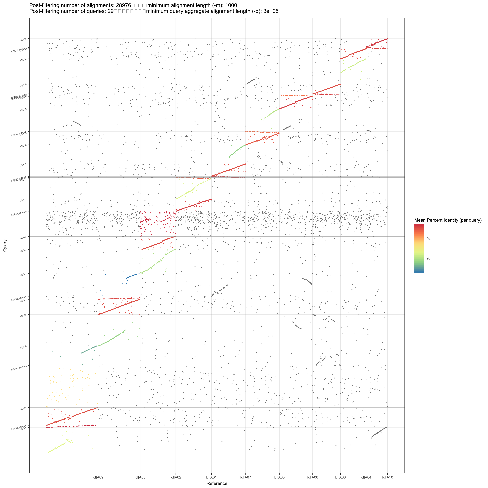
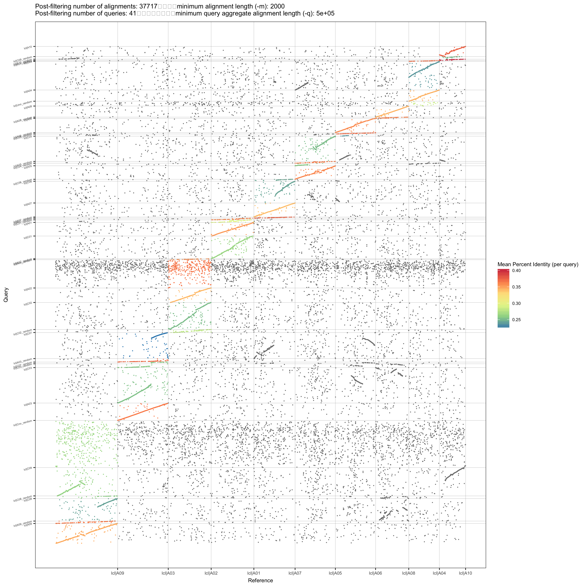

# dotPlotly example
Compare diploid [Brassica rapa](https://genomevolution.org/coge/GenomeInfo.pl?gid=28890) and allo-tetraploid [Brassica napus](https://genomevolution.org/coge/GenomeInfo.pl?gid=25695)
(hybrid of B. rapa and B. oleracea)

NB: Some differences between below dot plots (e.g. sparseness of alignments) may be due to filtering parameter settings (`-m` and `-q`).

### 1. Mummer example

```
nucmer --maxmatch -l 80 -c 100 Brassica_rapa.faa Brassica_napus_rape.faa -p Brapa_Bnapus.nucmer
delta-filter -r Brapa_Bnapus.nucmer.delta > Brapa_Bnapus.nucmer.delta.filter
show-coords -c Brapa_Bnapus.nucmer.delta.filter > Brapa_Bnapus.nucmer.delta.filter.coords
```

Make dot plot:


```
../mummerCoordsDotPlotly.R -i Brapa_Bnapus.nucmer.delta.filter.coords -o Brapa_Bnapus.nucmer.plot -m 1000 -q 300000 -k 10 -s -t -l -p 12
```



### 2. Minimap2 example 
(16 seconds on a Macbook Pro)

```
minimap2 -x asm5 Brassica_rapa.faa Brassica_napus_rape.faa > Brapa_Bnapus.minimap2.paf
```

Make dot plot:

```
../pafCoordsDotPlotly.R -i Brapa_Bnapus.minimap2.paf -o Brapa_Bnapus.minimap2.plot -m 2000 -q 500000 -k 10 -s -t -l -p 12
```


